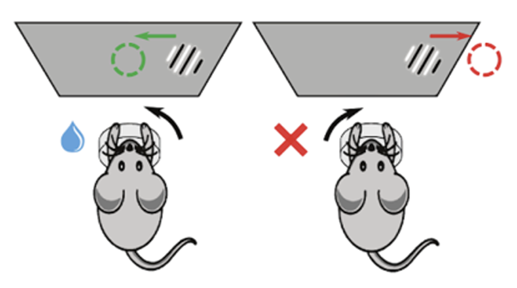
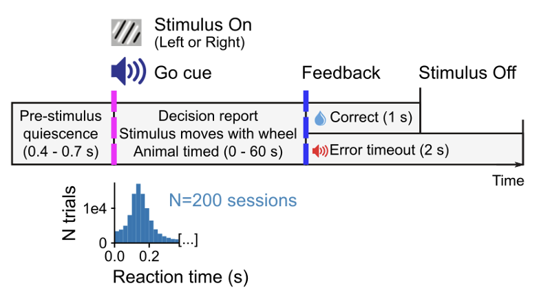
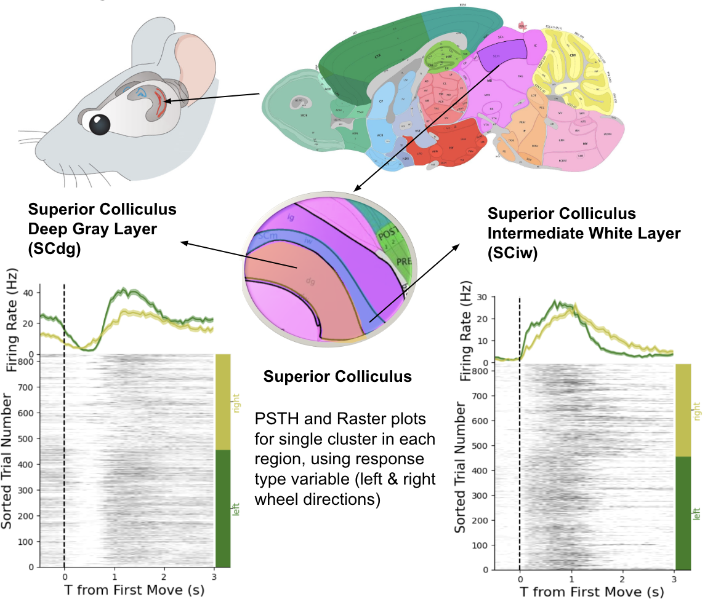
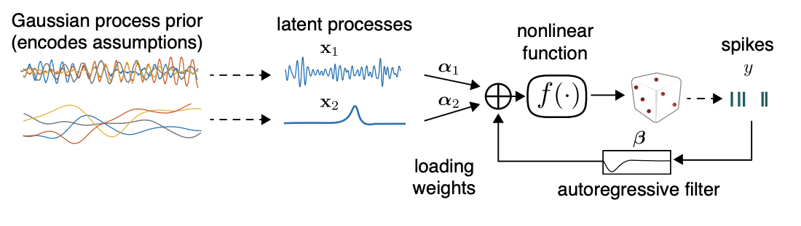
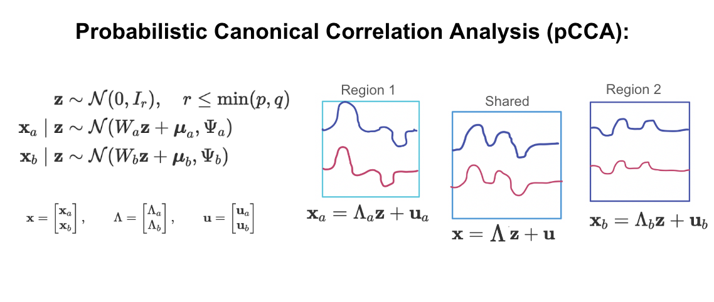
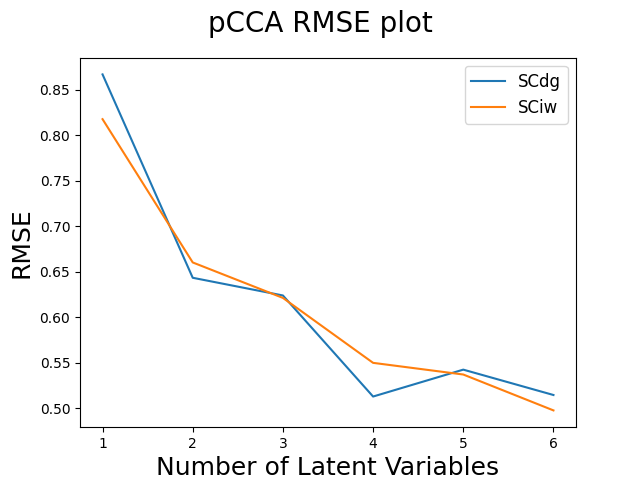

# Hierarchical Latent Variable Models for Neural Data Analysis
 

Sha lei: [s1lei@ucsd.edu](mailto:s1lei@ucsd.edu)

Yutian Shi: [yus029@ucsd.edu](mailto:yus029@ucsd.edu)

Courtney Cheung: [c6cheung@ucsd.edu](mailto:c6cheung@ucsd.edu)

Shuyu Wang: [shw043@ucsd.edu](mailto:shw043@ucsd.edu)

Mentor: Mikio Aoi [maoi@ucsd.edu](mailto:maoi@ucsd.edu)

        
Full Report:
<a href="https://github.com/courtneyacheung/Hierarchical-Latent-Variable-Models-for-Neural-Data-Analysis/blob/main/papers/DSC_Capstone_Q2_Report.pdf">Click Here </a>
 
GitHub code: 
<a href="https://github.com/courtneyacheung/Hierarchical-Latent-Variable-Models-for-Neural-Data-Analysis">Click Here </a>
 

## Introduction
The work on neural spike sorting has evolved substantially, emerging after new techniques that allow monitoring hundreds of neurons at the same time in a sub-millisecond. Nevertheless, due to the large amount of data that needs tobe processed, new algorithms that could handle the vast neural data while filtering useful parameters are mandatory. Our approach seeks to innovate by integrating these historical strengths while mitigating their weaknesses when performing the dimensional-reduction task, aiming for better capture of the dynamic of neural trajectories in the neural population activity.

We want to build a model that makes use of the advantages of GPFA and EM algorithms – namely, that GPFA works well with temporal data and that the EM algorithm is efficient for factor analysis, where multiple maximums need to be identified. Because Gaussian distributions produce positive and negative draws, a more appropriate modification to GPFA will use a Poisson distribution to reflect the true non-negative support of the discontinuous spike data. We would also like apply pCCA to two distinct brain regions in order to explore whether there is a relationship between neural activity in those regions during decision making tasks.

## Hierarchical Latent Variable Model Pipeline

### Data

The International Brain Laboratory used neuropixel probes to record neural activity from various mice brain areas during a decision-making task.

<figure>

        
        <figcaption>Fig.1 - Mice Brain Data From IBL</figcaption>

</figure>
 

**Decision Making Task:**
* The decision-making task requires the mouse to move the visual stimulus 35° to the center of the screen by using a wheel with its two front paws.
* The stimulus is presented on the left or right side of the screen with a probability that varies from one block of trials to the next.
* Zero-contrast stimuli are presented within these blocks, providing insight into the mouse's behavior prior to the likely side of the stimulus.
* Both behavioral and neural data are recorded simultaneously to study neural correlates of the behavior.
* Major behavioral events of interest for analysis include the stimulus onset time, the animal’s choice, the feedback delivery time, the feedback type (reward vs noise), the probability of the stimulus being on the left (block type), and the wheel motion onset time.
* In this task, the time between stimulus onset and wheel motion onset, referred to as the reaction time of the animals, is short, with a median of 150ms.

<figure style="text-align: center;">

  

    
    <figcaption>Fig.2 - Visual Stimulus Task on Mice </figcaption>
  

  

    
    <figcaption>Fig.3 - Experiment Process </figcaption>
  

</figure>        
 

**Region Selection:**
 
 
We pick the Midbrain region, Superior Colliculus, as the candidate regions, as it has the motor functions for controlling the eyes and brain’s orientation to the stimulus. We selected Superior Colliculus Deep Gray Layer (SCdg) and Superior Colliculus Intermediate White Layer (SCiw) as the two candidate regions, and we will explore whether they are activated simultaneously and the patterns of the neuron activities in these two regions under different task conditions by drawing Peristimulus time histogram (PSTH) and raster plot.
 
<figure>

        
        <figcaption>Fig.4 - Brain Region Selection and Exploratory Data Analysis For Each Region </figcaption>

</figure>
 

* Raster: a visual representation that shows the timing and occurrence of neural spikes over time. Each vertical line represents a spike and the horizontal line represents time. The Raster plot displays the firing patterns of neurons and is useful for analyzing the neural activities in the brain.
* Peri-Stimulus Time Histogram (PSTH): illustrates the neural firing rate in response to a stimulus over time. It provides the temporal pattern and strength of neural response which helps to analyze how neurons react to specific stimuli.
* Firing rate: the number of times that a neuron releases electrical energy in a given time period.

The EDA graph above indicates that for both SCdg and SCiw there is a significant change of the neuron firing rate happens after the mice begin to turn the wheel, and for the SCdg region, the neuron has different responses for decision variable that depends on left or right direction of turning the wheel. 

### Variational Gaussian Process Factor Analysis (vLGP)
Here, we learn the first layer of latent variables for each brain region. This model is a modifcation of Gaussian Process Factor Analysis (<a href="https://journals.physiology.org/doi/full/10.1152/jn.90941.2008?rfr_dat=cr_pub++0pubmed&url_ver=Z39.88-2003&rfr_id=ori%3Arid%3Acrossref.org">GPFA</a>) using the Poisson Distribution as well as Variational Inference. Variational inference is a method that approximates the complex true posterior p(x|y) with a simpler distribution q(x)). It is an essential foundation for us to construct our latent variable model.<a href="https://gregorygundersen.com/blog/2021/04/16/variational-inference/"> Learn about Variational Inference </a> 

To measure the approximation of variational distribution q(x) to the true posterior, the Kullback-Leibler (KL) divergence was introduced. 

$$D_{KL}(q || p) = \int_{-\infty}^\infty q(x) \log{\frac{q(x)}{p(x|y)}} dx$$ 

When the KL divergence is equal to 0, q(x) is exactly the same as the true posterior. Thus, minimizing the KL divergence helps us to find the optimal q(x) that best approximates the actual distribution. 

$$\log{p(y)} = L(q) + D_{KL}(q || p)$$

Minimizing the KL divergence is the same as maximizing the evidence lower bound $L(q)$ (ELBO), a lower bound of the log marginal likelihood (2016). Thus, q(x) can be optimized by maximizing ELBO.

<Figure>

        
        <figcaption>Fig.5 - <a href="https://arxiv.org/pdf/1604.03053.pdf">vLGP </a> workflow</figcaption>

</Figure>

 

 

#### Neural Trajectories of Superior Colliculus Deep Gray Layer:

<Figure>
        <iframe src='./images/SCdg_train_trajectories_plot.html' width=1100 height=1000 frameBorder=0></iframe>
        <figcaption>Fig.6 - Neural Trajectories For SCdg</figcaption>
</Figure>

 

#### Neural Trajectories of Superior Colliculus Intermediate White Layer:

<Figure>
        <iframe src='./images/SCiw_train_trajectories_plot.html' width=1100 height=1000 frameBorder=0></iframe>
        <figcaption>Fig.7 - Neural Trajectories For SCiw</figcaption>
</Figure>

<body>

    &#8595;

</body>

### Probabilistic Canonical Correlation Analysis
After fitting our data to the vLGP model, we would explore multi-region analysis to examine variability shared between regions. This will give us insight into how activity in brain regions may be correlated versus distinct during a given task. For this analysis, we use Probabilistic Canonical Correlation (pCCA). 

<figure>
        

        <figcaption>Fig.8 - pCCA Workflow Demonstration</figcaption>
</figure>
 
<a href="https://gregorygundersen.com/blog/2018/09/10/pcca/">Learn about pCCA </a>
 

## Conclusion
From the two regions’ neural trajectories generated from the vLGP, there are clear separa- tions between wheels turning right and wheels turning left in the brain regions Superior Colliculus Deep Gray Layer and Intermediate White Layer, which means that there are different neural activity patterns under left and right direction conditions. However, we cannot make a conclusion about whether one region is driven by another when both are activated.

Increase in the number of latent variables in pCCA model leads to smaller RMSE be- tween the actual latent variable and estimated latent variable from the two regions, which conforms to the rules that with more latent variables, the model captures the complexity of the latent variable better.
 
<figure>

<figcaption>Fig.9 - PCCA RMSE</figcaption>
</figure>
 
For future research, we would like to explore the correlation between regions in more depth by reconstructing the data based on the learned latent variables produced by pCCA. Further research could also include investigating whether there is causation between neural activity in the Superior Colliculus Deep Gray Layer and Intermediate White Layer, which helps us to understand the co-function of these two regions and decode neural acitivities by inference models.

Also, the result is based on the experiments on homologue mice's brain, since human brain might functions and responds differently, we could not make conclusions on human brain.

